# Samvid OS Visual Workflow

Last updated: 2026-03-20

This document gives a visual view of how the major Samvid OS functions work across web, mobile, backend, realtime events, and tenant operations.

It is intentionally business-flow focused. For file-by-file technical coverage, use:

- [Web Frontend Pages and Components](./FRONTEND_WEB_DOCUMENTATION.md)
- [Mobile Screens and Components](./MOBILE_APP_DOCUMENTATION.md)
- [Backend Functionality and API Surface](./BACKEND_FUNCTIONALITY_DOCUMENTATION.md)

## 1. System Map

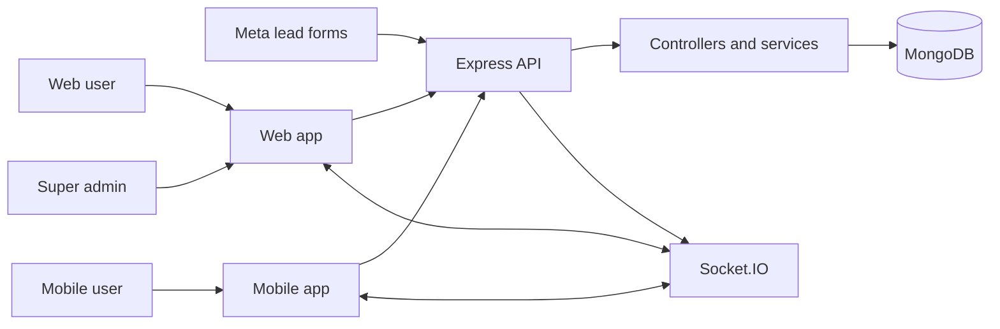

**Core idea**

- Web and mobile both use the same backend domain logic.
- API requests handle auth, role gating, tenant scope, and persistence.
- Socket.IO handles realtime chat, call, alert, and approval signals.
- MongoDB stores tenants, users, leads, inventory, chat, targets, and subscriptions.

**Primary source anchors**

- `frontend/src/App.jsx`
- `mobile/src/navigation/RootNavigator.tsx`
- `backend/src/app.js`
- `backend/src/server.js`

## 2. Role and Tenant Hierarchy

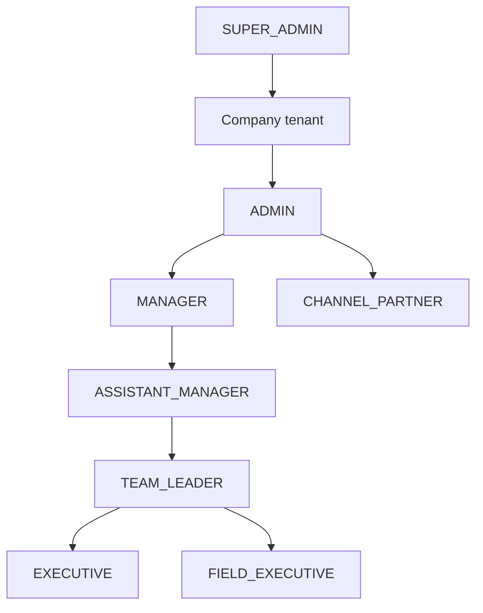

**What this means operationally**

- `SUPER_ADMIN` works at platform level across all tenants.
- `ADMIN` owns one company tenant and controls approvals, users, and tenant settings.
- Management roles control teams and lead distribution inside the tenant hierarchy.
- Executives and field executives operate on assigned work.
- Channel partners remain tenant-scoped but with tighter access.

**Primary source anchors**

- `backend/src/constants/role.constants.js`
- `backend/src/routes/user.routes.js`
- `backend/src/routes/saas.routes.js`

## 3. Login, Tenant Resolution, and Session Flow

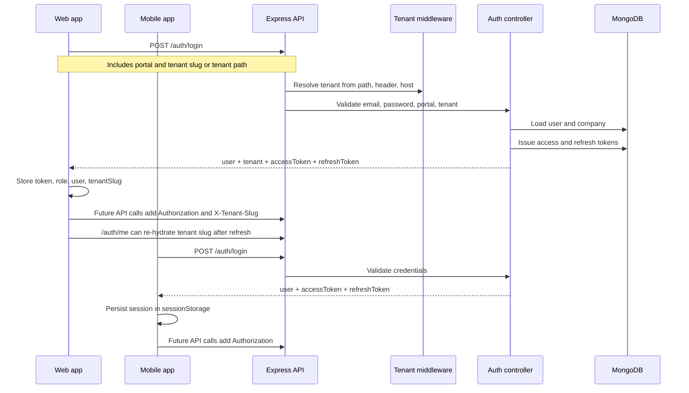

**Web-specific runtime rules**

- The web app keeps tenant-aware URLs like `/<tenant-slug>/leads`.
- Session restore can redirect the browser back into the tenant-prefixed route space.
- Inactivity timeout and theme settings are applied on the client shell.

**Mobile-specific runtime rules**

- Mobile restores the stored session on app start.
- If session expiry is reached in background or refresh fails, the app clears session and returns to login.

**Primary source anchors**

- `backend/src/middleware/tenant.middleware.js`
- `backend/src/controllers/auth.controller.js`
- `frontend/src/components/auth/Login.jsx`
- `frontend/src/utils/tenantRouting.js`
- `frontend/src/services/api.js`
- `mobile/src/context/AuthContext.tsx`
- `mobile/src/services/api.ts`

## 4. Client Runtime Flow

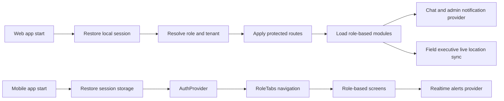

**Primary source anchors**

- `frontend/src/App.jsx`
- `frontend/src/context/chatNotificationProvider.jsx`
- `mobile/src/navigation/RootNavigator.tsx`
- `mobile/src/navigation/RoleTabs.tsx`
- `mobile/src/context/RealtimeAlertsContext.tsx`

## 5. Lead Lifecycle

```mermaid
flowchart TD
  SRC[Lead source]
  MANUAL[Manual lead create]
  BULK[Bulk CSV upload]
  META[Meta webhook lead]
  CREATE[Create lead record]
  ASSIGN[Run auto assignment]
  SELF[Self assign to active executive requester]
  TEAM[Assign inside requester team]
  HIER[Assign by hierarchy or global fallback]
  MATRIX[Show in Leads Matrix and dashboards]
  WORK[Update status, diary, follow-up, activity]
  REQUEST[Optional status request]
  PENDING[Pending admin review]
  APPROVE[Approve or reject]
  CLOSE[Deal close path]
  REMAIN[Partial payment follow-up]

  SRC --> MANUAL --> CREATE
  SRC --> BULK --> CREATE
  SRC --> META --> CREATE
  CREATE --> ASSIGN
  ASSIGN --> SELF
  ASSIGN --> TEAM
  ASSIGN --> HIER
  SELF --> MATRIX
  TEAM --> MATRIX
  HIER --> MATRIX
  MATRIX --> WORK
  WORK --> REQUEST
  REQUEST --> PENDING
  PENDING --> APPROVE
  WORK --> CLOSE
  CLOSE --> REMAIN
```

**Flow explanation**

- Leads enter the system from manual creation, admin bulk upload, or Meta webhook ingestion.
- New leads are auto-assigned using hierarchy-aware balancing logic.
- Users then work the lead through lead details, follow-ups, diaries, and activity tracking.
- Sensitive state transitions can enter a status-request approval path.
- Close and payment flows can trigger admin notifications and additional follow-up work for remaining collection.

**Assignment logic**

- If an active executive or field executive creates the lead, the lead can self-assign.
- If a management user creates the lead, the system tries to assign within that reporting tree.
- If no local team candidate is best, the service falls back to hierarchy/global balancing.

**Primary source anchors**

- `backend/src/routes/lead.routes.js`
- `backend/src/controllers/lead.controller.js`
- `backend/src/services/leadAssignment.service.js`
- `frontend/src/modules/leads/LeadsMatrix.jsx`
- `mobile/src/modules/leads/LeadsMatrixScreen.tsx`
- `mobile/src/modules/leads/LeadDetailsScreen.tsx`

## 6. Deal Closure and Payment Approval Flow

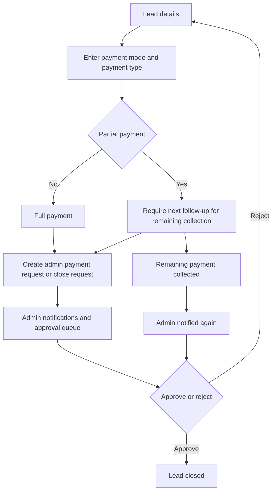

**Key business rules**

- Non-cash close paths require a payment reference.
- Partial payments require a positive remaining amount.
- Partial-payment close flows must keep the collection loop open through a next follow-up.
- Admin receives realtime events for payment approval, deal closure, and remaining-payment collection.

**Primary source anchors**

- `backend/src/controllers/lead.controller.js`
- `frontend/src/modules/admin/AdminNotifications.jsx`
- `frontend/src/context/chatNotificationProvider.jsx`
- `mobile/src/modules/notifications/NotificationsScreen.tsx`
- `mobile/src/context/RealtimeAlertsContext.tsx`

## 7. Inventory Workflow

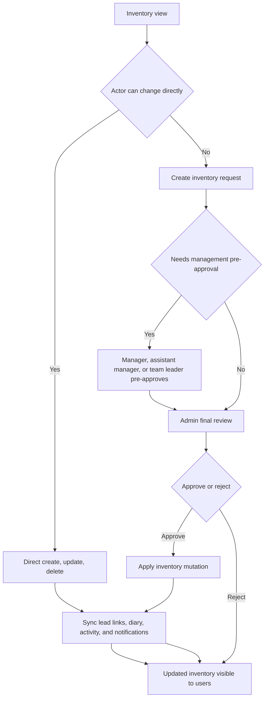

**Important status-specific rules**

- `Blocked` requests require a lead selection and a diary note.
- `Sold` requests require `saleDetails`, including payment information and the linked lead.
- Review events emit realtime notifications to admin, role, company, and team rooms.

**Primary source anchors**

- `backend/src/routes/inventory.routes.js`
- `backend/src/routes/inventoryRequest.routes.js`
- `backend/src/controllers/inventory.controller.js`
- `backend/src/controllers/inventoryRequest.controller.js`
- `backend/src/controllers/inventoryApproval.controller.js`
- `backend/src/services/inventoryWorkflow.service.js`
- `backend/src/services/inventoryNotification.service.js`
- `frontend/src/modules/inventory/AssetVault.jsx`
- `mobile/src/modules/inventory/AssetVaultScreen.tsx`

## 8. Realtime Chat, Alerts, and Calling

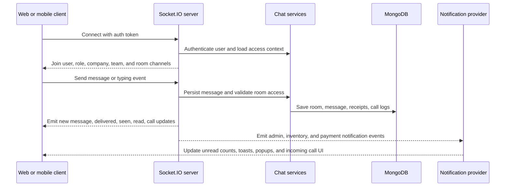

**What runs through the realtime layer**

- Room and direct messaging
- Typing, delivered, seen, and room-read receipts
- Incoming and outgoing call signaling
- Admin request alerts
- Inventory approval alerts
- Lead payment approval alerts

**Primary source anchors**

- `backend/src/server.js`
- `backend/src/socket/chat.socket.js`
- `backend/src/services/chatRoom.service.js`
- `backend/src/services/chatCall.service.js`
- `frontend/src/modules/chat/TeamChat.jsx`
- `frontend/src/context/chatNotificationProvider.jsx`
- `mobile/src/modules/chat/ChatConversationScreen.tsx`
- `mobile/src/modules/chat/CallScreen.tsx`
- `mobile/src/context/RealtimeAlertsContext.tsx`

## 9. Meta Webhook to Lead Pipeline

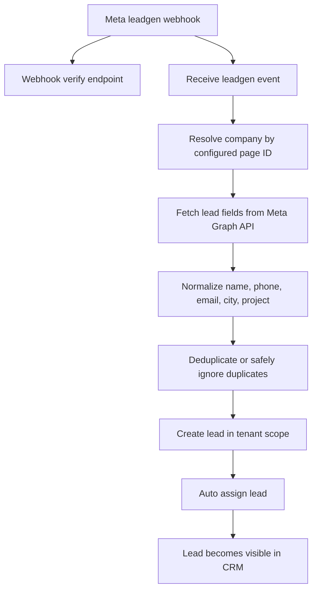

**Why this matters**

- A single webhook surface can route events to the correct tenant by page ownership.
- Company-scoped page configuration decides which tenant receives a Meta lead.
- New Meta leads immediately join the same lead workflow as manual and bulk-created leads.

**Primary source anchors**

- `backend/src/routes/webhook.routes.js`
- `backend/src/controllers/webhook.controller.js`
- `backend/src/services/leadAssignment.service.js`
- `backend/src/controllers/saas.controller.js`

## 10. Targets, Reports, and Samvid Intelligence

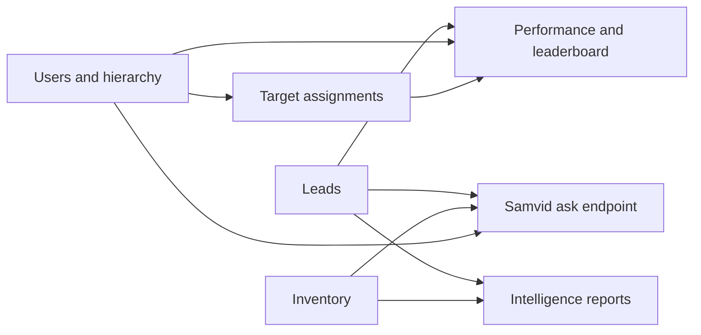

**Functional view**

- Targets are assigned through hierarchy-aware target APIs.
- Performance screens compare target achievement with live lead activity.
- Reports aggregate lead funnel, aging, inventory, and team output.
- Samvid queries the same live business data and returns intent-based snapshots.

**Primary source anchors**

- `backend/src/routes/target.routes.js`
- `backend/src/controllers/target.controller.js`
- `backend/src/routes/samvid.routes.js`
- `backend/src/controllers/samvid.controller.js`
- `frontend/src/modules/reports/Performance.jsx`
- `frontend/src/modules/reports/IntelligenceReports.jsx`
- `mobile/src/modules/reports/PerformanceScreen.tsx`
- `mobile/src/modules/chat/SamvidBotScreen.tsx`

## 11. SaaS and Tenant Administration Flow

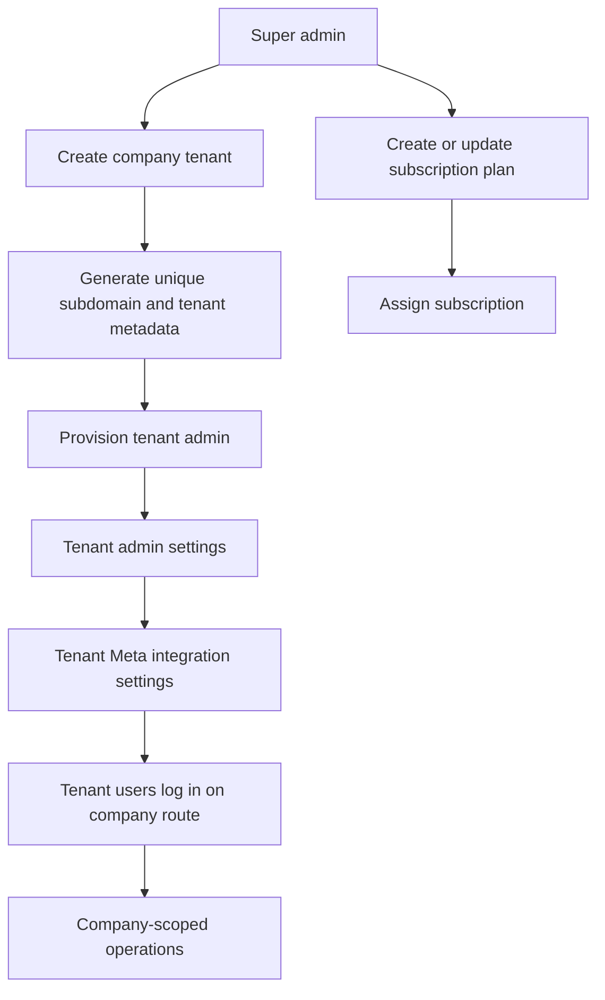

**Operational view**

- `SUPER_ADMIN` manages tenants, plans, analytics, and usage.
- Tenant admins manage their own settings and Meta integration.
- Once a tenant is configured, normal web and mobile users operate within that company scope.

**Primary source anchors**

- `backend/src/routes/saas.routes.js`
- `backend/src/controllers/saas.controller.js`
- `backend/SAAS_ARCHITECTURE.md`
- `frontend/src/modules/admin/SuperAdminPanel.jsx`
- `frontend/src/services/saasService.js`

## 12. End-to-End Summary

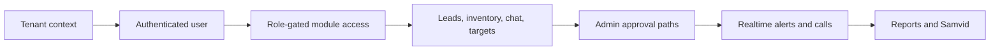

Samvid OS is essentially a tenant-aware operating system for sales teams:

- tenant resolution decides data ownership
- auth and role rules decide access
- lead and inventory workflows drive daily operations
- realtime events keep teams and admins synchronized
- reports, targets, and Samvid turn operations into insight

